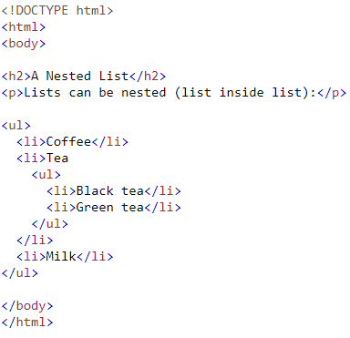

# HTML Lists, CSS Boxes, JS Control Flow

## 1. HTML Lists

* We have 3 types of lists:

-Unordered lists: Bullet points

-Ordered lists: numbers

-Definition lists: terms with definition
 
* We can nest lists, exapmle: 

## 2- CSS Boxes

* CSS treats each HTML element as if it lives in its own box.
* We are able to change the width and hight of that box in CSS.
* We can limit the hight and width of the box. This is useful because sometimes elements in the web page change size to fit the user's screen. We can do this using these properties:

 *min-hight, max hight*
 *min width, max width*

* The boxes are made up of 3 parts: padding, border and margins
* If the text is larger than the box we have two options: 
1. *overflow: hidden* ---> this hides extra text
2. *overflow: scroll* ---> this add a scroll bar

* Some properties in CSS have shorthands.These are shorter ways to write a code. For example the shorthand for the border property ---> Border: width style color
* We can allign boxes using the *text-align* property.

## 3. JS Control Flow

* A flow chart is a diagram that represents the flow of our program. 
* We have 3 types of loops:
1. [While Loop](https://www.w3schools.com/js/js_loop_while.asp)
2. [For Loop](https://www.w3schools.com/js/js_loop_for.asp)
3. [Do...while Loop](https://www.journaldev.com/16536/java-do-while-loop#:~:text=Java%20do%2Dwhile%20loop%20is,loop%20execution%20at%20least%20once.) 

 
 

