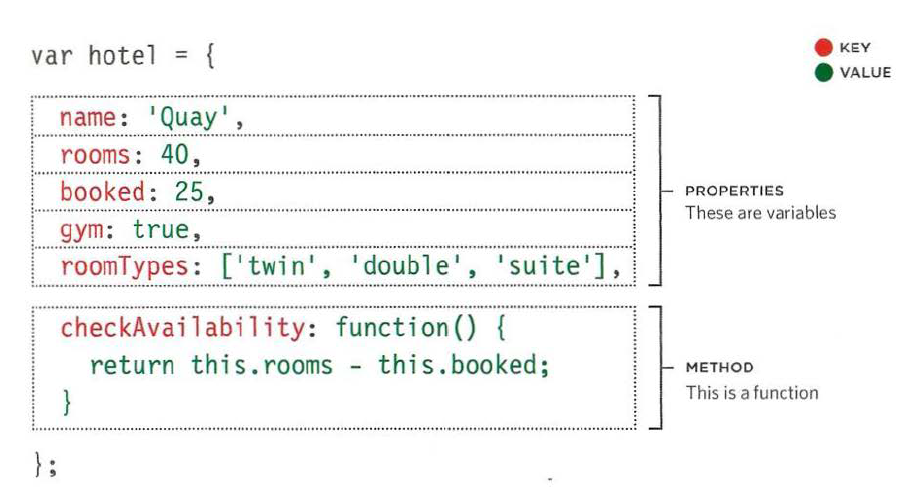

# Objects
## What are they?
Objects group together a set of variables and functions to create a model of a something you would recognize from the real world.

* In objects Variables are called **properties** and Functions are called **Mthods**. 
### Properties refer to general information about the object.
### Methods refer to the tasks related to the object.

* The names of proporties and methods are called **keys**. 
* The value of property key: string, boolean, number array, or another object.
* The value of a method key: a function only.
### Example of object structure:

 

## Literal Notion
* this is the easiest way to create objects.
* keys are separated from their values with a colon. 
* We can access properties and methods of an object using the **dot notion**:
nameofobject.nameofmethod/property

*The dot in the syntax above is called a *member operator*: this means that the method/property is a member of the object. 

# The Document Object Model (DOM)
* It is a set of rules that specifies how we can access and edit a live website.
* It is based on 2 ideas:
1. MAKING A MODEL OF THE HTML PAGE: When the browser loads a web page, it
creates a model of the page in memory in the form of a tree.
2. ACCESSING AND CHANGING THE HTML PAGE: It defines a set of methods and properties and uses them to change the website's content.
* Application Programming Interface (API), i.e. DOM: The DOM states what our script can "ask the browser about the current page, and how to tell the browser to update what is being shown to the user.
* The  DOM Tree Nodes: 
-The Document Node
-The Element Node
-Attribute Nodes 
-Text Nodes
### How to access the DOM tree?
1: Locate the node that represents the element you want to work with.
2: Use its text content, child elements, and attributes.

*The methods that are used to find/locate elements in the DOM tree are called **DOM queries**.
* There is a large number of quesries; some return one element and others return a NodeList. 

