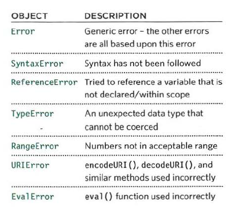

# Error Handling and Debugging in JS
## Variable Scopes:
1. Global Scope: If a variable is declared outside a function, it can
be used anywhere because it has global scope.
2. Function-Level Scope: When a variable is declared within a function,
it can only be used within that function.

## Notes: 
* When a statement has to call some other code in order to do its job,
the new task goes to the top of the pile of things to do.
* We can call functions before they have been declared.
if they were created using function declarations not function expressions/Anonymous functions.
* We can assign a value to a variable that has not yet been
declared.
* "Imagine that each function is a nesting doll. The children can ask the parents for information in their variables. But the parents cannot get variables from their children. Each child will get the same answer from the same parent."
* If a JavaScript statement generates an error, then it throws an exception. At that point, the interpreter stops and looks for exception-handling code. If the error is not handled,
the script will just stop processing and the user will
not know why.
* Types of built-in error objects in JavaScript:
 


## What to do when you encounter an error:
### 1. Debug the script to fix errors: track the source of the error and fix it.
### 1.1 Review the error message in the console
### 1.2 Check when the script is breaking
### 1.3 Use breakpoints where things are going wrong
### 1.4 If nothing works, try rubber duck debugging.
### 2. Handle errors gracefully: using try, catch, throw, and finally statement. (when you can't solve an error)

```
try {
// Try to execute this code
catch (exception) {
// If there is an exception, run this code
finally {
// This always gets executed
}
```


## Console Methods
1. conso1e.info() can be used for general information
2. console.warn() can be used for warnings
3. console.error() can be used to hold errors
4. console.group() can be used to group the messages together.
5. console.table() can be used to output a table showing: 
-objects  -arrays that contain other objects or arrays
6. console.assert() can test if a condition is met, and write 
to the console only if the expression evaluates to false.

